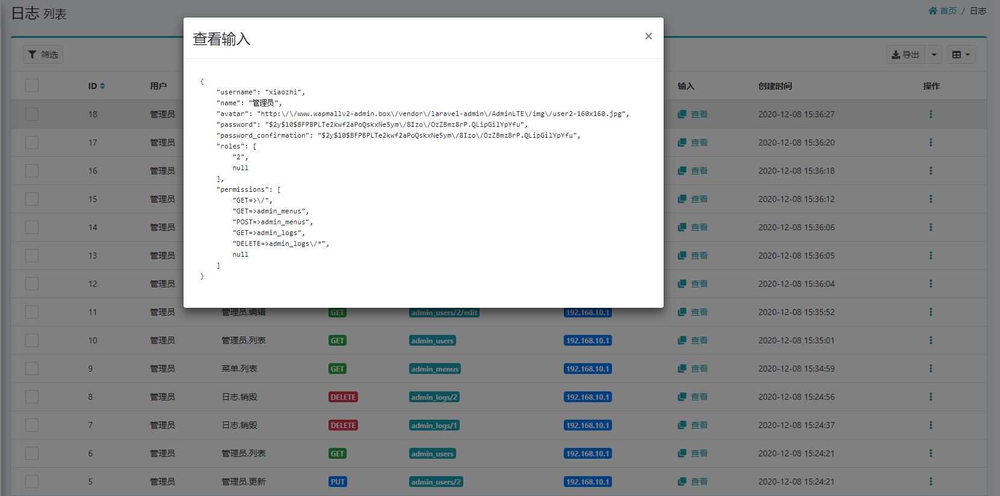

# operation-log extension for laravel-admin 2.x

## 预览图
> 如果无法显示预览图，请搜“GitHub无法显示图片”解决


## 安装扩展

```shell
composer require pucoder/operation-log
```

## 发布资源

```shell script
php artisan vendor:publish --provider="Encore\OperationLog\OperationLogServiceProvider"
```

## 初始化

```shell script
php artisan operation-log:init
```


